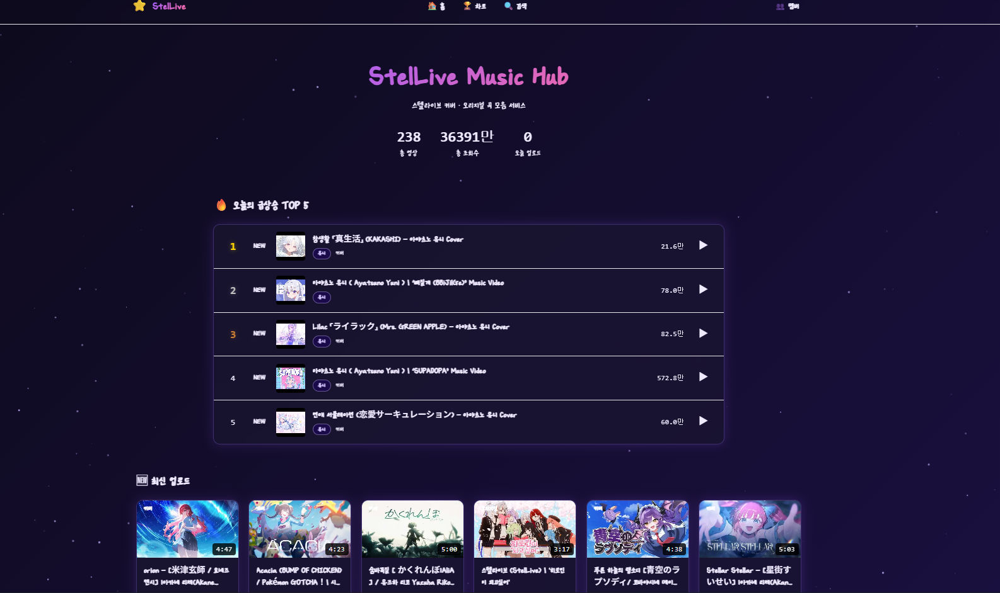
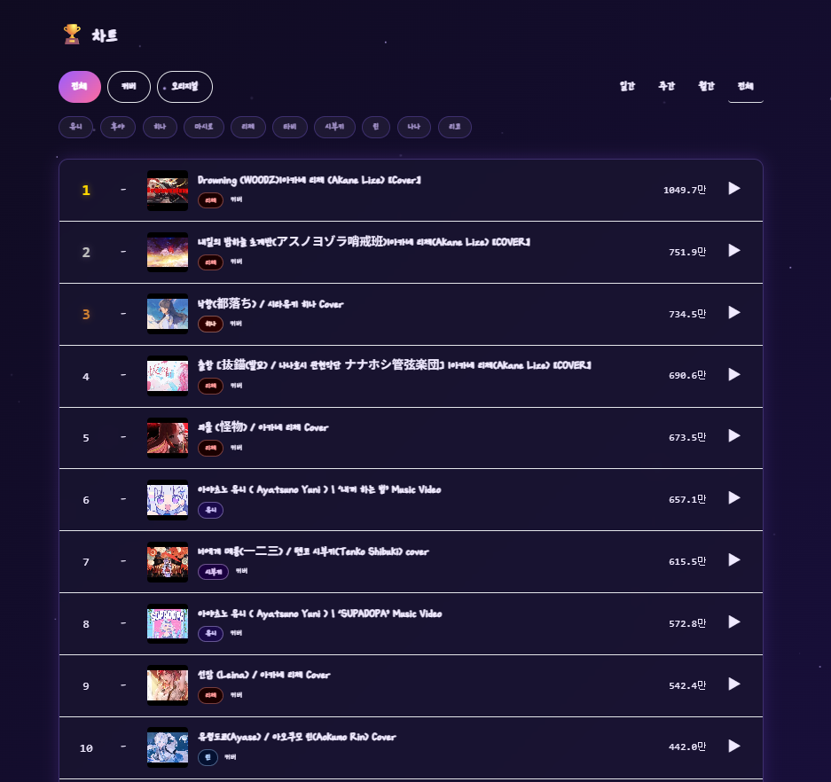
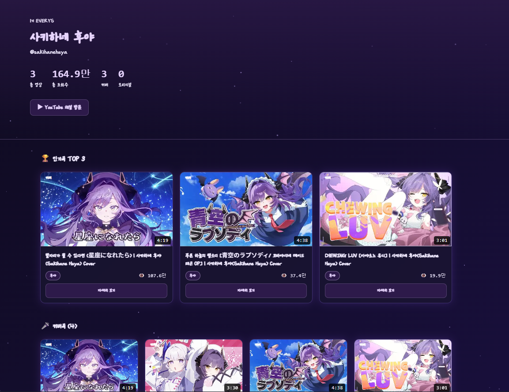
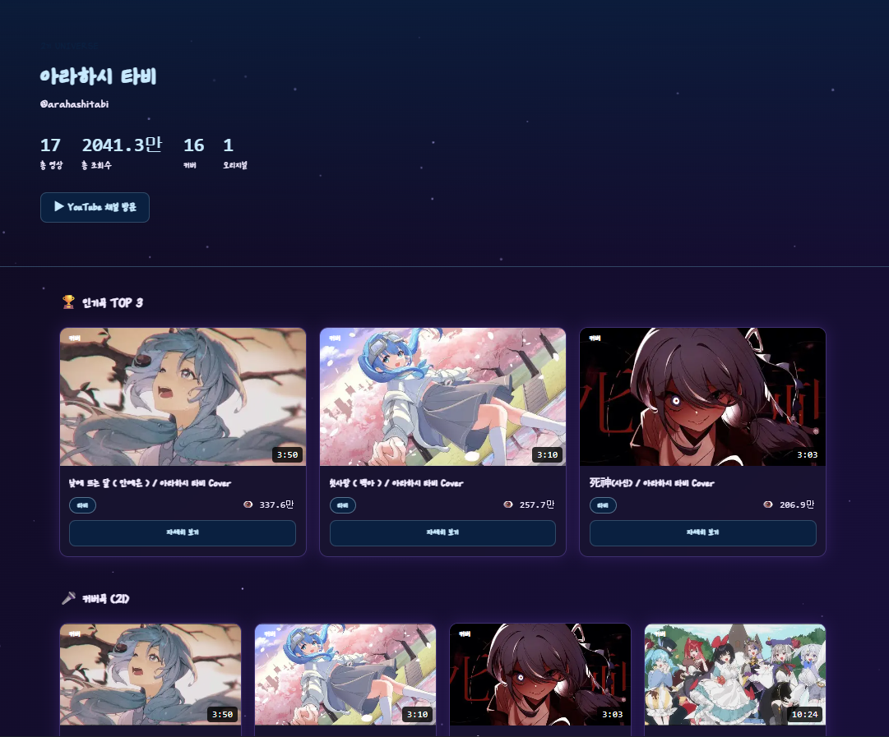
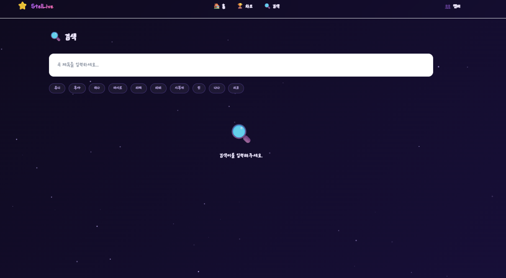
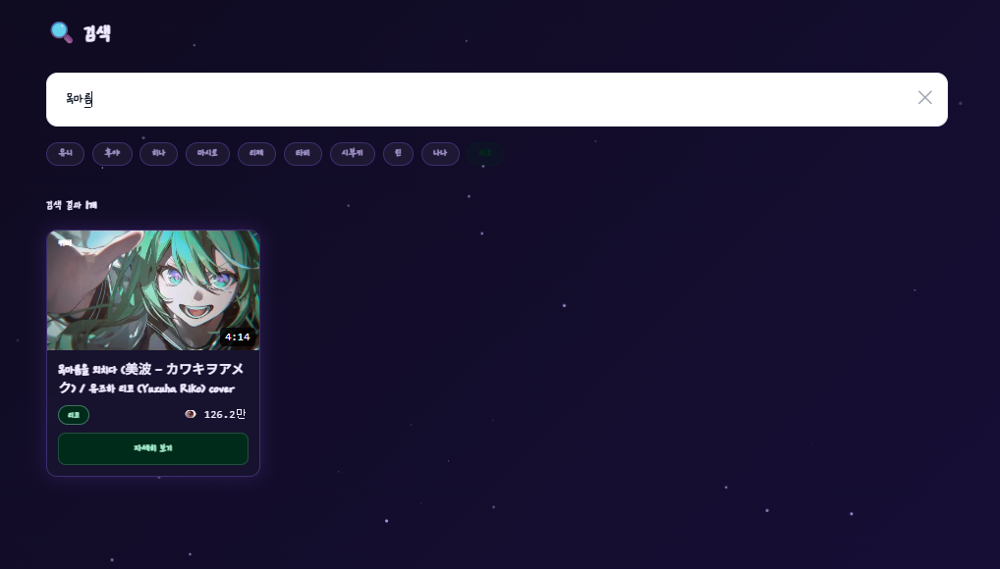

# ⭐ StelLive Music Hub

> 스텔라이브(StelLive) 버튜버 그룹의 커버곡 및 오리지널 곡을 모아서 보여주는 멜론 스타일의 음악 커뮤니티 웹사이트



---

## 📌 프로젝트 개요

YouTube Data API v3를 사용해 스텔라이브 멤버들의 음악 영상을 자동으로 수집하고,  
재생 · 랭킹 · 조회수 분석 기능을 제공하는 팬메이드 서비스입니다.

> **⚠️ 본 프로젝트는 팬이 제작한 비공식 서비스입니다.**  
> 수익화 목적이 없으며, 모든 영상 저작권은 스텔라이브 및 각 멤버에게 있습니다.

---

## 🖥️ 화면 구성

### 메인 페이지

- 오늘의 급상승 TOP 5
- 최신 업로드 영상 6개
- 전체 통계 (총 영상 수, 총 조회수, 오늘 업로드)

### 차트 페이지

- 멜론 스타일 순위표 (전체 / 커버 / 오리지널)
- 기간별 필터 (일간 / 주간 / 월간 / 전체)
- 멤버별 필터 토글

### 멤버 페이지


- 멤버별 프로필 및 통계
- 인기곡 TOP 3
- 커버 / 오리지널 전체 목록

### 검색 페이지


- 곡 제목 실시간 검색
- 멤버별 필터 검색

---

## 🛠️ 기술 스택

**백엔드**
- Python 3.11+
- FastAPI
- SQLite + SQLAlchemy
- APScheduler (자동 수집 스케줄러)
- YouTube Data API v3

**프론트엔드**
- Next.js 14 (App Router) + TypeScript
- Tailwind CSS
- Framer Motion
- Recharts
- YouTube IFrame Player API

---

## 📁 프로젝트 구조

```
stellive-music-hub/
├── backend/
│   ├── main.py              # FastAPI 앱 진입점
│   ├── database.py          # SQLAlchemy 설정
│   ├── models.py            # DB 모델
│   ├── schemas.py           # Pydantic 스키마
│   ├── constants.py         # 멤버 색상 및 상수
│   ├── youtube_service.py   # YouTube API 수집 로직
│   ├── filter_service.py    # 음악 영상 필터링
│   ├── scheduler.py         # APScheduler 자동 갱신
│   └── routers/
│       ├── songs.py
│       ├── ranking.py
│       ├── members.py
│       └── admin.py
└── frontend/
    ├── app/
    │   ├── page.tsx          # 메인
    │   ├── chart/            # 차트
    │   ├── songs/[id]/       # 플레이어
    │   ├── members/[name]/   # 멤버
    │   └── search/           # 검색
    ├── components/
    │   ├── MiniPlayer.tsx
    │   ├── SongCard.tsx
    │   ├── RankingRow.tsx
    │   ├── MemberBadge.tsx
    │   ├── MemberButton.tsx
    │   ├── ViewChart.tsx
    │   ├── StarBackground.tsx
    │   └── Navbar.tsx
    └── lib/
        ├── api.ts
        ├── memberColors.ts
        └── playerContext.tsx
```

---

## ⚙️ 설치 및 실행

### 1. 환경변수 설정

`backend/.env` 파일 생성:

```env
YOUTUBE_API_KEY=your_youtube_data_api_v3_key
DATABASE_URL=sqlite:///./stellive_music.db
ADMIN_API_KEY=your_admin_secret_key
```

`frontend/.env.local` 파일 생성:

```env
NEXT_PUBLIC_API_BASE_URL=http://localhost:8000
```

### 2. 백엔드 실행

```bash
cd backend
pip install -r requirements.txt
uvicorn main:app --reload
```

### 3. 프론트엔드 실행

```bash
cd frontend
npm install
npm run dev
```

### 4. 접속

- 프론트엔드: http://localhost:3000
- API 문서: http://localhost:8000/docs

---

## 🔄 자동 수집 스케줄

| 주기 | 작업 |
|------|------|
| 매 6시간 | 각 플레이리스트 신규 영상 확인 및 저장 |
| 매 1시간 | 전체 영상 조회수 / 좋아요 수 갱신 |
| 앱 최초 실행 | 전체 플레이리스트 영상 일괄 수집 |

---

## 👥 스텔라이브 멤버 출처

본 서비스에서 수집하는 YouTube 채널 및 플레이리스트 출처입니다.

### 스텔라이브 공식
| 채널 | YouTube |
|------|---------|
| 스텔라이브 공식 | [@StelLive_official](https://www.youtube.com/@StelLive_official) |

### 1기생 EVERYS
| 멤버 | YouTube |
|------|---------|
| 아야츠노 유니 (Ayatsuno Yuni) | [@ayatsunoyuni](https://www.youtube.com/@ayatsunoyuni) |
| 사키하네 후야 (Sakihane Huya) | [@sakihanehuya](https://www.youtube.com/@sakihanehuya) |

### 2기생 UNIVERSE
| 멤버 | YouTube |
|------|---------|
| 시라유키 히나 (Shirayuki Hina) | [@shirayukihina](https://www.youtube.com/@shirayukihina) |
| 네네코 마시로 (Neneko Mashiro) | [@neneko_mashiro](https://www.youtube.com/@neneko_mashiro) |
| 아카네 리제 (Akane Lize) | [@akanelize](https://www.youtube.com/@akanelize) |
| 아라하시 타비 (Arahashi Tabi) | [@arahashitabi](https://www.youtube.com/@arahashitabi) |

### 3기생 cliché
| 멤버 | YouTube |
|------|---------|
| 텐코 시부키 (Tenko Shibuki) | [@tenkoshibuki](https://www.youtube.com/@tenkoshibuki) |
| 아오쿠모 린 (Aokumo Rin) | [@aokumorin](https://www.youtube.com/@aokumorin) |
| 하나코 나나 (Hanako Nana) | [@hanakonana](https://www.youtube.com/@hanakonana) |
| 유즈하 리코 (Yuzuha Riko) | [@yuzuhariko](https://www.youtube.com/@yuzuhariko) |

---

## ⚖️ 저작권 고지 / Copyright Notice

```
본 프로젝트는 팬이 제작한 비공식 서비스로, 스텔라이브 및 관계사와
어떠한 공식적인 관계도 없습니다.

- 수록된 모든 영상의 저작권은 스텔라이브 각 멤버 및 스텔라이브 운영사에 있습니다.
- 영상 재생은 YouTube 공식 IFrame API를 통해 이루어지며, 직접 다운로드나 재배포는 하지 않습니다.
- 본 서비스는 광고 수익 등 상업적 목적으로 운영되지 않습니다.
- 저작권 관련 문의가 있을 경우 즉시 해당 콘텐츠를 삭제하겠습니다.

This project is an unofficial fan-made service and has no official affiliation
with StelLive or its management.

- All video copyrights belong to the respective StelLive members and their management.
- Videos are played via the official YouTube IFrame API. No direct downloads or redistribution.
- This service is not operated for any commercial purpose.
- If you have any copyright concerns, the relevant content will be removed immediately.
```

---

## 📝 개발 정보

- **개발자**: bird8696
- **개발 기간**: 2026년 4월
- **GitHub**: [bird8696/stellive-music-hub](https://github.com/bird8696/stellive-music-hub)

---

*⭐ StelLive Music Hub는 스텔라이브를 사랑하는 팬이 만든 서비스입니다.*
